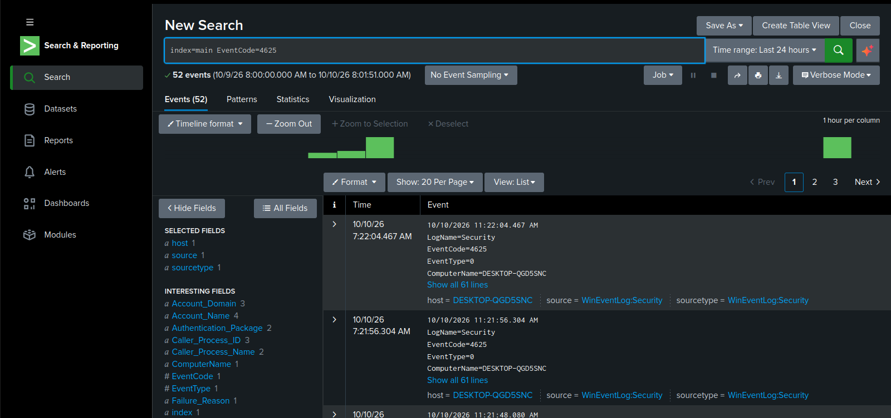
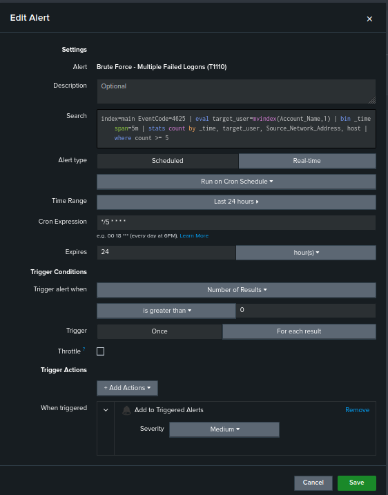
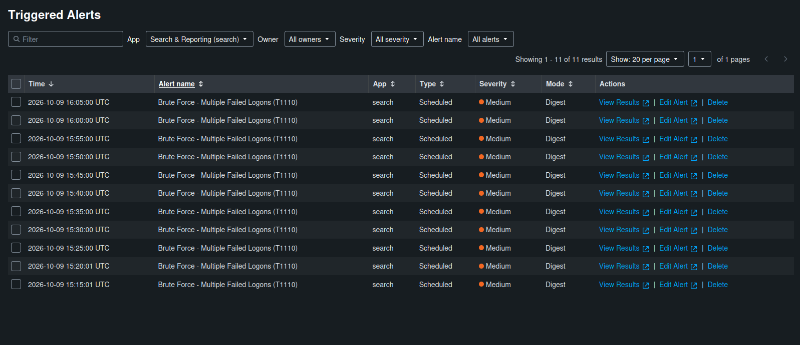

# Splunk + Sysmon Detection Lab

## Objective
Build a small SOC lab that collects Windows logs, detects suspicious activity, and documents findings the way an L1 analyst would.

## Architecture
- **Endpoint:** Windows 11 VM with Sysmon (SwiftOnSecurity config)
- **Forwarding:** Splunk Universal Forwarder sends logs to the server
- **SIEM:** Splunk Enterprise on an Ubuntu Server VM, firewalled with UFW (only ports 8000 and 9997 allowed)
- **Platform:** VMware Workstation Pro

## Log sources
- Windows Security (logons, privileges)
- Windows System
- Sysmon Operational (process creation and more)

## Detections

| Name | ATT&CK | Log source | Logic | False positives |
|---|---|---|---|---|
| Multiple failed logons | T1110.001 | Security 4625 | 5+ failures in 5 min per user and source | User forgetting their password |

### Brute-force detection: analyst notes
**Query:** [detections/brute-force-4625.spl](detections/brute-force-4625.spl)

**Triage steps when it fires:**
1. Check the target account: does it exist, and is it privileged?
2. Check the source address and logon type (Type 3 network or Type 10 RDP is more suspicious than Type 2 at the keyboard).
3. Check whether a successful logon (4624) follows the failures from the same source.
4. Escalate if a success follows, the account is privileged, or the source is external.

**Tuning:** threshold set to 5 failures in 5 minutes to catch guessing while ignoring a single typo. This can be adjusted per environment.

## Testing
Simulated a password-guessing attack with failed network logons:

```powershell
1..10 | ForEach-Object {
  net use \\localhost\IPC$ /user:fakeadmin "WrongPass$_" 2>$null
  Start-Sleep -Seconds 2
}
```

Result: failed logons (Event ID 4625) for `fakeadmin`, and the alert triggered on its 5-minute schedule.

## Screenshots

**Failed logon events (Event ID 4625)**


**Brute-force alert configuration**


**Alert triggered**


## Challenges and fixes
- **Empty statistics table.** My `stats` search grouped by `IpAddress`, which didn't exist in the 4625 events, so every row was dropped. Fixed by inspecting a raw event and using the real field names.
- **Sysmon logs missing in Splunk.** Sysmon was logging locally, but the forwarder wasn't sending it. Fixed by correcting the `inputs.conf` stanza, restarting the forwarder service, and verifying with `btool`.
- **Real-time time range returned nothing.** Real-time searches only show new events, so I used a "last 24 hours" window for historical data.

## Roadmap
- [ ] Suspicious PowerShell detection (T1059.001) using Sysmon Event ID 1
- [ ] L1 incident tickets for each alert (in `/reports`)
- [ ] Architecture diagram
- [ ] Rebuild detections in Microsoft Sentinel (KQL)
