# Splunk + Sysmon Detection Lab

## Objective
Build a small SOC lab that collects Windows logs, detects suspicious activity, and documents findings the way an L1 analyst would.

## Architecture
- **Endpoint:** Windows 11 VM with Sysmon (SwiftOnSecurity config)
- **Forwarding:** Splunk Universal Forwarder sends logs to the server
- **SIEM:** Splunk Enterprise on an Ubuntu Server VM, firewalled with UFW (only ports 8000 and 9997 allowed)
- **Platform:** VMware Workstation Pro
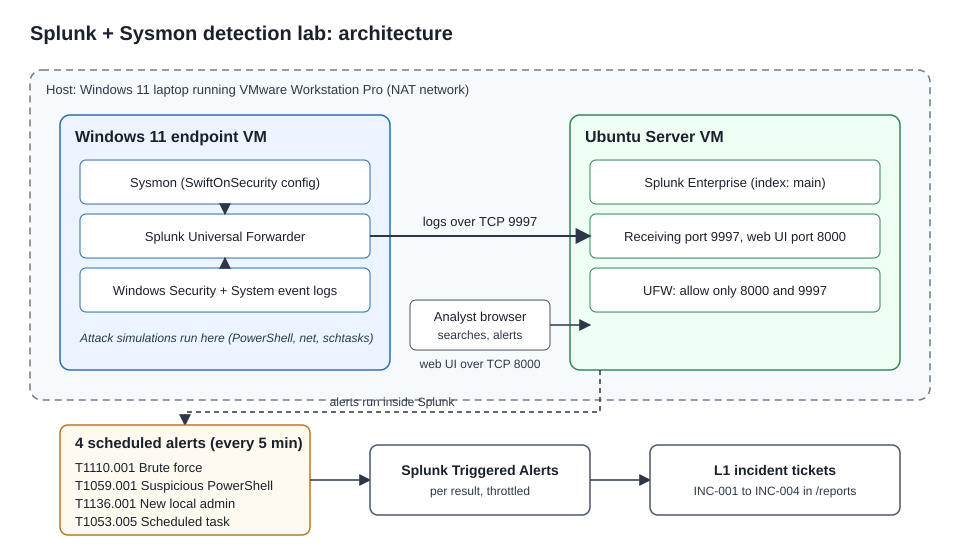

## Log sources
- Windows Security (logons, privileges)
- Windows System
- Sysmon Operational (process creation and more)

## Detections

| Name | ATT&CK | Log source | Logic | False positives |
|---|---|---|---|---|
| Brute Force - Multiple Failed Logons | T1110.001 | Security 4625 | 5+ failures in 10 min per user and source | User forgetting their password |
| Suspicious PowerShell Execution | T1059.001 | Sysmon Event ID 1 | Encoded, hidden, bypass or download flags on powershell.exe | Admin scripts and installers using Bypass |
| New Local Admin Account | T1136.001 | Security 4720 + 4732 | New account added to Administrators (group SID S-1-5-32-544) | IT onboarding, deployment tools |
| Suspicious Scheduled Task Creation | T1053.005 | Sysmon Event ID 1 | `schtasks /create` with 2+ risk flags (SYSTEM, logon/startup trigger, script action, user-writable path) | Installers, updaters, admin maintenance tasks |

### Brute-force detection: analyst notes
**Query:** [detections/brute-force-4625.spl](detections/brute-force-4625.spl)

**Triage steps when it fires:**
1. Check the target account: does it exist, and is it privileged?
2. Check the source address and logon type (Type 3 network or Type 10 RDP is more suspicious than Type 2 at the keyboard).
3. Check whether a successful logon (4624) follows the failures from the same source.
4. Escalate if a success follows, the account is privileged, or the source is external.

**Tuning:** threshold of 5 failures catches guessing while ignoring a single typo. The search looks back 10 minutes and repeats are suppressed per user for 30 minutes, so one attack produces one alert.

### PowerShell detection: analyst notes
**Query:** [detections/suspicious-powershell-t1059-001.spl](detections/suspicious-powershell-t1059-001.spl)

**Triage steps when it fires:**
1. Check the `reason` field: which suspicious flag matched?
2. Check `ParentImage`: PowerShell launched by Word, Excel or a browser is a major red flag; launched by an admin's terminal is less so.
3. Decode any encoded command (base64, UTF-16) to see what it actually runs.
4. Check the user and host, and whether the same activity is scheduled or recurring.
5. Escalate if the parent is an Office app or browser, the payload downloads or runs remote content, or the account isn't expected to use PowerShell.

**Tuning:** 10-minute lookback, suppression per host for 30 minutes. Expected false positives are deployment scripts that use `-ExecutionPolicy Bypass`.

### New local admin detection: analyst notes
**Query:** [detections/new-local-admin-t1136-001.spl](detections/new-local-admin-t1136-001.spl)

**Triage steps when it fires:**
1. Identify the actor (who created the account) and the new account name and SID.
2. Check for a change request or onboarding ticket that explains it.
3. Check what the new account did: logons (4624) and processes started by its SID.
4. Look for other persistence from the same actor (scheduled tasks, services).
5. Escalate if there is no change record, the actor is not an IT admin, or the account has been used.

**Tuning:** triggers only on the Administrators group SID (S-1-5-32-544) so Windows' automatic Users-group event doesn't alert. Events are correlated by SID because 4732 shows the member only as a SID. 10-minute lookback, suppression per member SID for 30 minutes, severity High.

### Scheduled task detection: analyst notes
**Query:** [detections/suspicious-scheduled-task-t1053-005.spl](detections/suspicious-scheduled-task-t1053-005.spl)

**Triage steps when it fires:**
1. Read the `reason` flags: SYSTEM, logon or startup trigger, script or LOLBin action, user-writable path.
2. Identify the task name, trigger, run-as account and the program it launches.
3. Check `ParentImage`: an interactive shell is less suspicious than an Office app or browser.
4. Check whether the task has run, and what it started.
5. Escalate if it runs as SYSTEM and launches a script or binary from a user-writable path, or if the creator is unexpected.

**Tuning:** requires 2 or more of 4 risk flags. 10-minute lookback, suppression per host for 30 minutes.
**Limitation:** only sees tasks created with `schtasks.exe`.

## Testing
Simulated a password-guessing attack with failed network logons:

```powershell
1..10 | ForEach-Object {
  net use \\localhost\IPC$ /user:fakeadmin "WrongPass$_" 2>$null
  Start-Sleep -Seconds 2
}
```

Result: failed logons (Event ID 4625) for `fakeadmin`, and the alert triggered.

Simulated attacker-style PowerShell with harmless commands:

```powershell
$enc = [Convert]::ToBase64String([Text.Encoding]::Unicode.GetBytes("whoami"))
powershell.exe -NoProfile -WindowStyle Hidden -EncodedCommand $enc
powershell.exe -NoProfile -ExecutionPolicy Bypass -Command "Write-Output 'test'"
```

Result: both commands were detected, with reasons "Encoded command", "Hidden window" and "Execution policy bypass".

Simulated persistence by creating a local account and adding it to Administrators:

```powershell
net user labtest10 "Lab#Pass2026!" /add
net localgroup administrators labtest10 /add
```

Result: events 4720 and 4732 were correlated by the account's SID and the alert triggered once at High severity.

Simulated scheduled task persistence with a harmless task that runs as SYSTEM at logon:

```powershell
schtasks /create /tn "LabUpdater2" /tr "C:\Windows\System32\cmd.exe /c echo lab-test2" /sc onlogon /ru SYSTEM /f
```

Result: the alert triggered at High severity. The task never executed, because it only starts at logon and I deleted it first.

## Screenshots

**Failed logon events (Event ID 4625)**

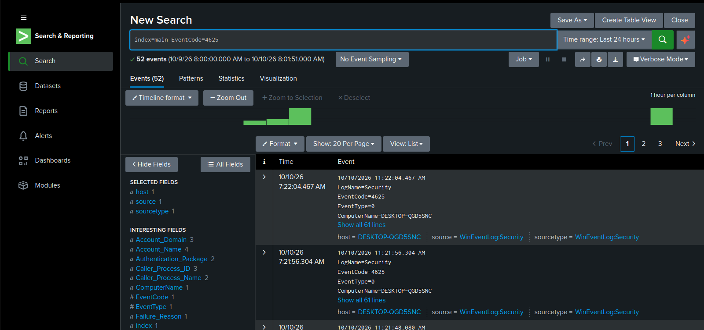

### Before tuning
**Alert configuration (v1)**

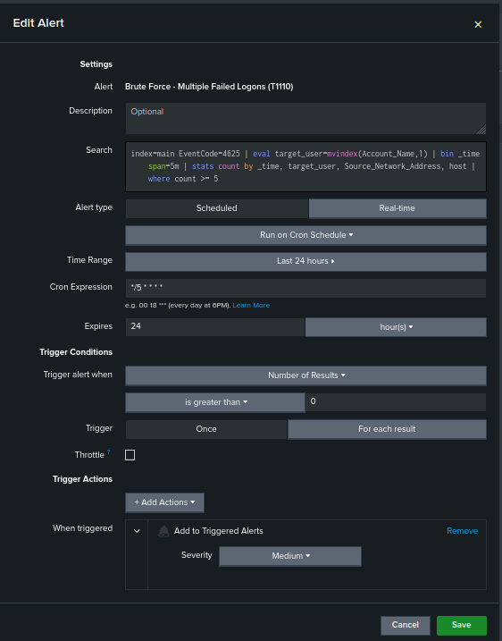

**11 alerts for a single test**

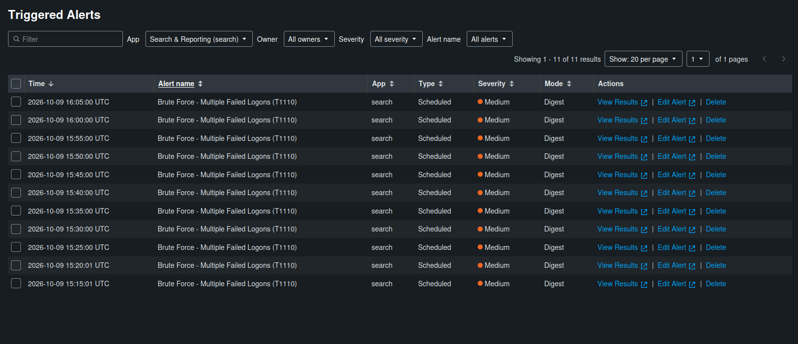

### After tuning
**Tuned search and schedule (v2)**

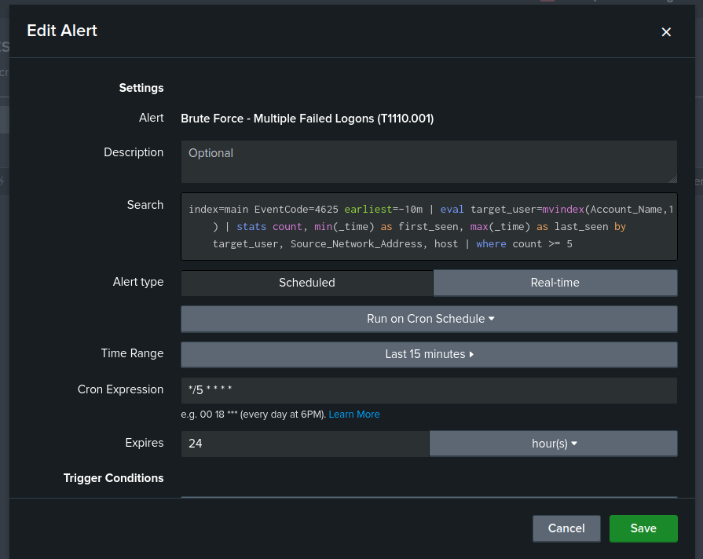

**Trigger and throttle settings**

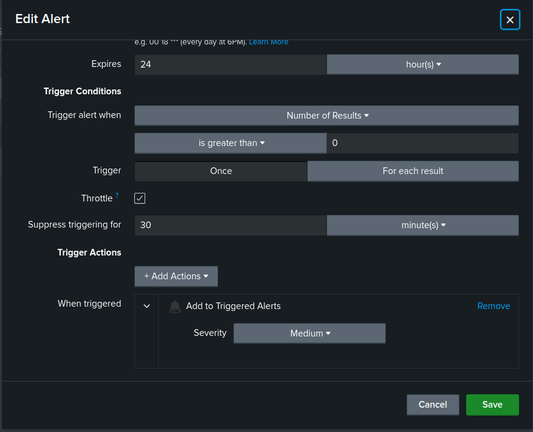

**One alert for the same test (Mode: Per Result)**

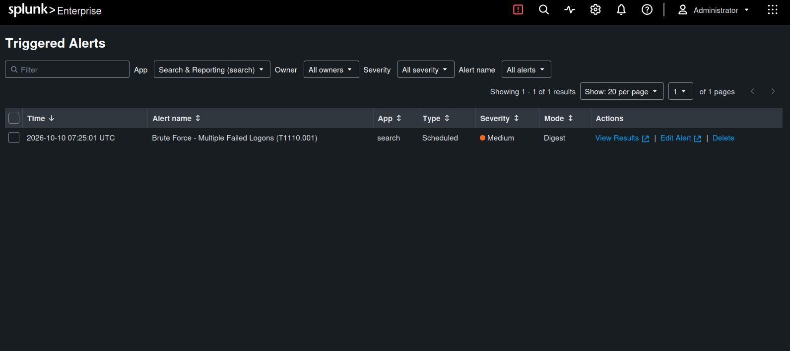

### PowerShell detection
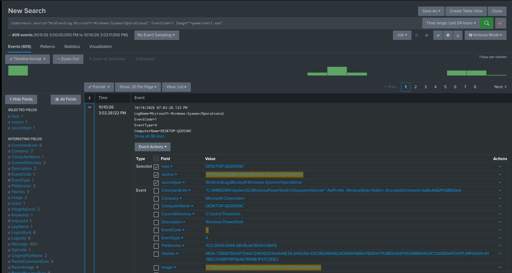
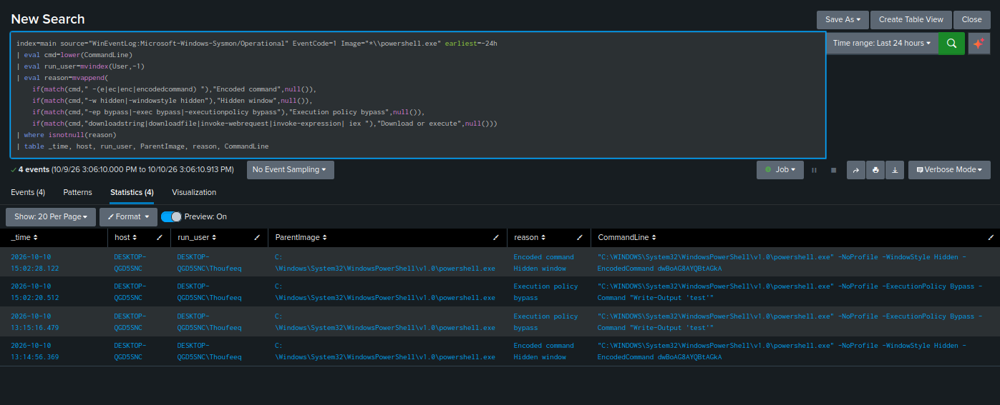
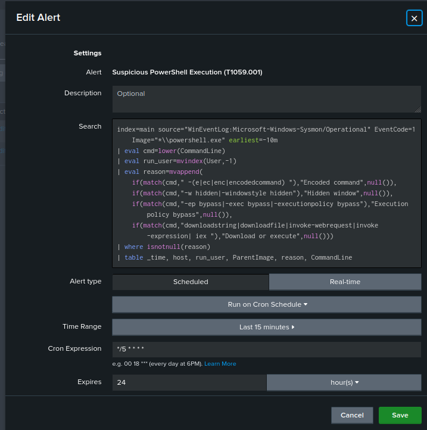
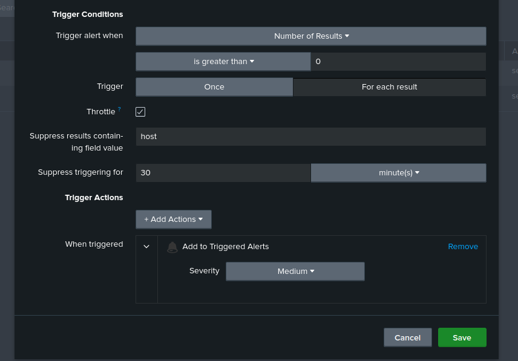
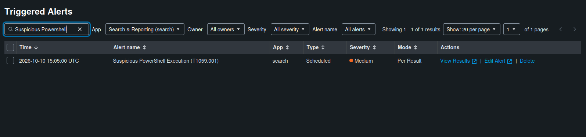

### New local admin detection
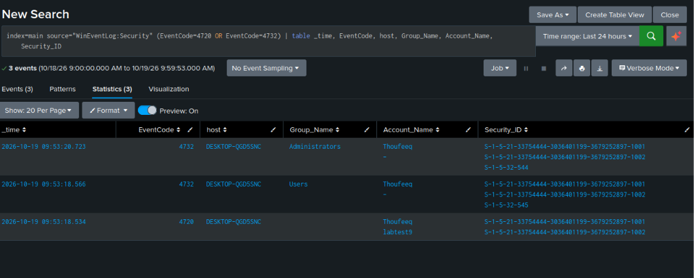
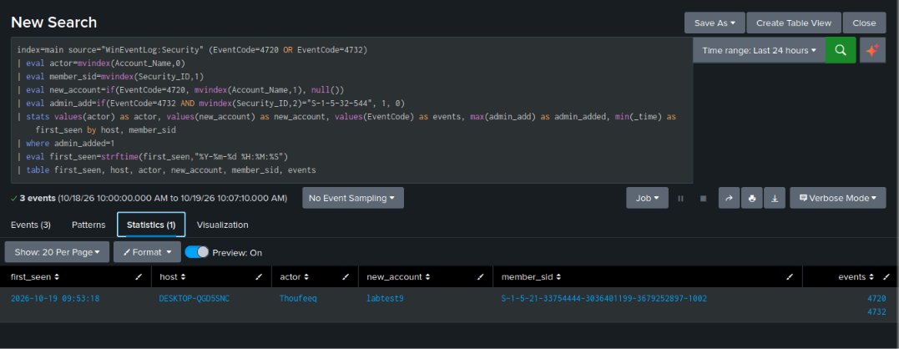
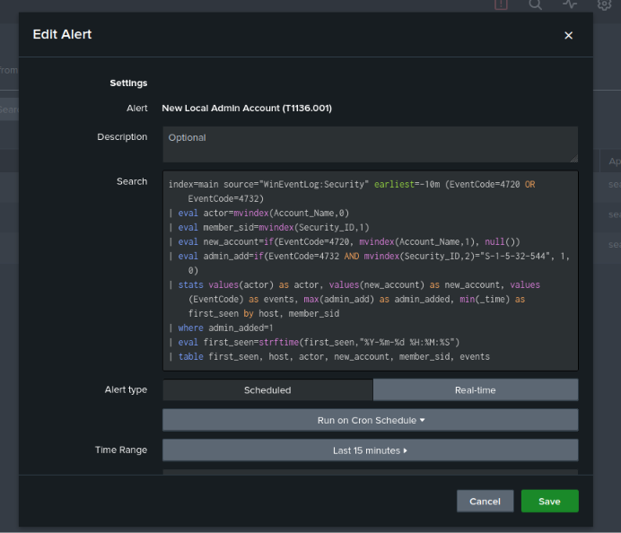
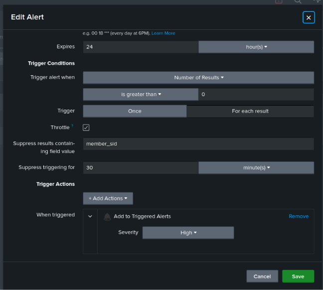
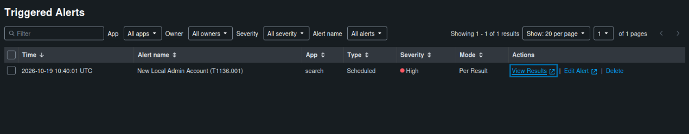

### Scheduled task detection
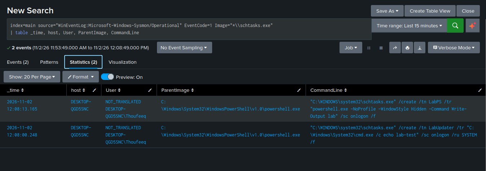
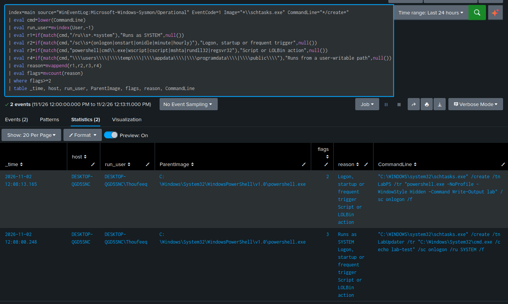
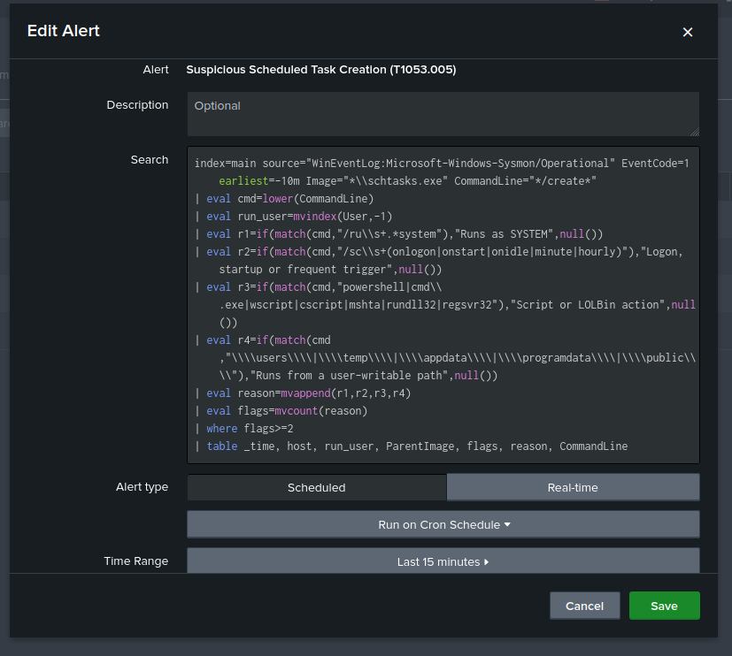
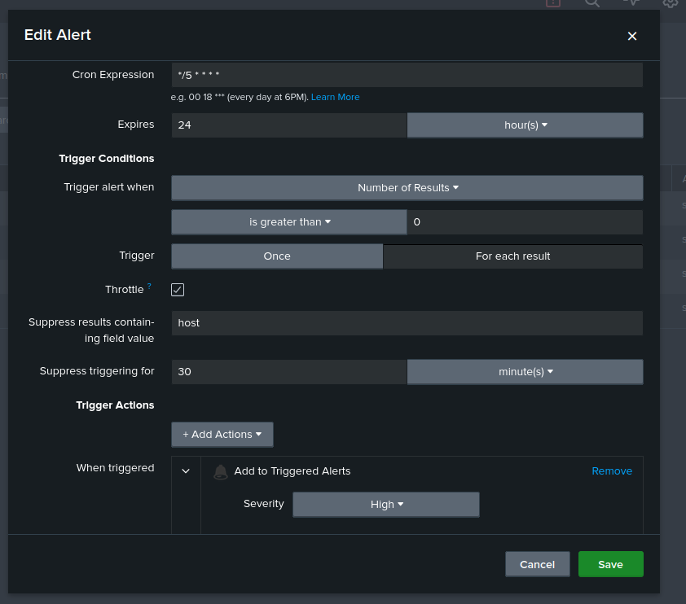
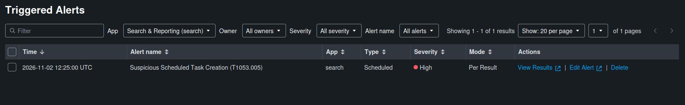
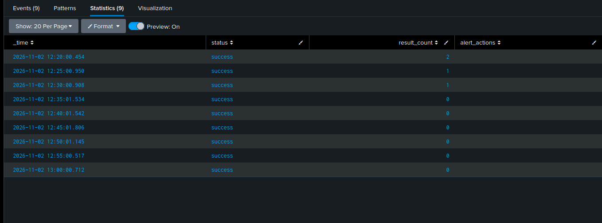

## Incident tickets
| ID | Alert | Verdict |
|---|---|---|
| [INC-001](reports/INC-001-suspicious-powershell.md) | Suspicious PowerShell Execution | True positive (simulated), not escalated |
| [INC-002](reports/INC-002-brute-force-failed-logons.md) | Brute Force - Multiple Failed Logons | True positive (simulated), not escalated |
| [INC-003](reports/INC-003-new-local-admin-account.md) | New Local Admin Account | True positive (simulated), not escalated |
| [INC-004](reports/INC-004-suspicious-scheduled-task.md) | Suspicious Scheduled Task Creation | True positive (simulated), not escalated |

## Challenges and fixes
- **Empty statistics table.** My `stats` search grouped by `IpAddress`, which didn't exist in the 4625 events, so every row was dropped. Fixed by inspecting a raw event and using the real field names.
- **Sysmon logs missing in Splunk.** Sysmon was logging locally, but the forwarder wasn't sending it. Fixed by correcting the `inputs.conf` stanza, restarting the forwarder service, and verifying with `btool`.
- **Real-time time range returned nothing.** Real-time searches only show new events, so I used a "last 24 hours" window for historical data.
- **Duplicate alerts.** The first version re-triggered every 5 minutes (11 alerts for one test) because the search had no tight time window and no throttling. Fixed with a 10-minute lookback and a 30-minute per-user suppression.
- **Query syntax error.** Splunk rejected my first PowerShell search with "'-' only takes numbers" because text patterns beginning with a dash were broken by misplaced quotes. Fixed by splitting the logic into small `eval` steps with patterns that don't start with a dash.
- **Wrong `User` value.** Sysmon events returned two `User` values, one of them `NOT_TRANSLATED`. Fixed by selecting the last value with `mvindex(User,-1)`.
- **Alert on every new account.** Windows adds each new account to the Users group automatically (an extra 4732 event). Fixed by triggering only when the group SID is S-1-5-32-544 (Administrators).
- **No account name in the group event.** Event 4732 showed the member only as a SID, so I correlated events by SID instead of name.
- **Duplicate alerts on the new-admin detection.** The first test produced two alerts for one attack. The saved alert's throttle field had a typo (`member _sid`), so suppression never matched, and the search had no `earliest=-10m`, so it used the alert's 15-minute window. Because the alert runs every 5 minutes, overlapping windows re-read the same event. I fixed both, retested, and got one alert. I changed both at once, so I can't isolate which alone mattered, but the throttle is what stops overlapping runs from re-alerting.
- **Alert ran on the wrong window at first.** The first scheduled run (12:20 UTC) returned 2 results, the test tasks created at 12:08, which a 10-minute lookback would not have reached. That suggests my first saved version didn't yet have `earliest=-10m`. I corrected the saved search, confirmed it with Edit Alert, and retested with a new task. Both the 12:25 and 12:30 runs found the new task, but the throttle produced only one alert, which I confirmed in the scheduler log.

## Roadmap
- [x] Brute-force detection (T1110.001)
- [x] Suspicious PowerShell detection (T1059.001)
- [x] New local admin account detection (T1136.001)
- [x] Scheduled task persistence detection (T1053.005)
- [x] Architecture diagram
